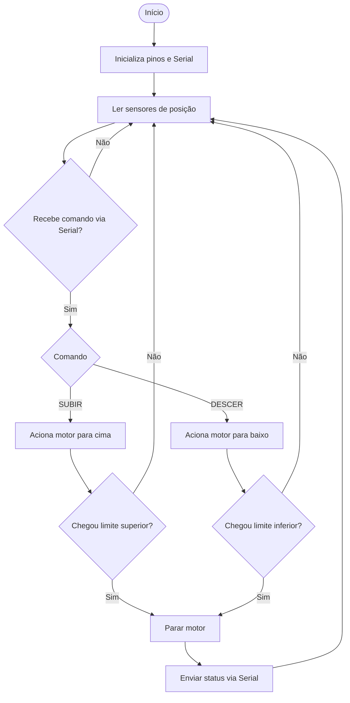

# 🚀 Projeto Didático de IoT – Elevador com Arduino, LEGO, WPF e MQTT

Este projeto foi desenvolvido com fins **educacionais** para demonstrar aos alunos do curso técnico em Desenvolvimento de Sistemas o uso do protocolo **MQTT** aplicado à Internet das Coisas (IoT).

A solução integra:

- 🖥️ Uma aplicação **WPF (C#)** que atua como **Publisher**, recebendo dados do Arduino via porta serial e publicando em tópicos MQTT.
- 🔧 Um **Arduino** com sensores ultrassônicos e de fim de curso, simulando um **elevador didático**.
- 📡 Um **Subscriber (WPF)** que consome as mensagens MQTT e exibe em interface gráfica.
- ☁️ O broker MQTT utilizado foi o público [test.mosquitto.org](https://test.mosquitto.org/).

---

## 🎯 Objetivos Didáticos

- Mostrar na prática como funciona a comunicação **Publisher → Broker → Subscriber** no MQTT.  
- Ensinar conceitos de **QoS (Quality of Service)** no protocolo.  
- Integrar hardware (Arduino) e software (WPF) em um projeto funcional.  
- Fornecer aos alunos uma experiência aplicada de **IoT**.

---

## ⚙️ Tecnologias Utilizadas

- **Arduino UNO**  
- **Sensores ultrassônicos e HW-870** para detecção de altura e limites do elevador  
- **C# WPF** para as interfaces gráficas (Publisher e Subscriber)  
- **MQTTnet** (biblioteca MQTT para .NET)  
- **Broker público test.mosquitto.org**

---

## 🏗️ Arquitetura da Solução


### 🚀 Fluxograma – Arduino



## 🔹 Fluxograma – WPF Publisher
### 💻 Fluxograma – WPF Publisher

```mermaid
flowchart TD
    A([Início]) --> B[Conectar ao Broker MQTT]
    B --> C[Abrir conexão Serial com Arduino]
    C --> D[Ler dados recebidos do Arduino]
    D --> E[Transformar em mensagem JSON]
    E --> F[Publicar mensagem no tópico MQTT]
    F --> D
    C --> G{Botão de comando acionado?}
    G -- Sim --> H[Enviar comando SUBIR/DESCER ao Arduino]
    G -- Não --> D
````
## 🔹 3. Fluxograma – WPF Subscriber
### 📡 Fluxograma – WPF Subscriber

```mermaid
flowchart TD
    A([Início]) --> B[Conectar ao Broker MQTT]
    B --> C[Inscrever-se no tópico do elevador]
    C --> D[Receber mensagem MQTT]
    D --> E[Decodificar JSON]
    E --> F[Atualizar interface gráfica]
    F --> C
````
---

## 📸 Demonstração

### 🔹 Hardware: conjunto completo


### 🔹 Hardware: vista superior


### 🔹 Hardware: controle subida e descida


### 🔹 Hardware: lateral do elevador


### 🔹 Hardware: placa parte posterior


### 🔹 Hardware: vista lateral


### 🔹 Hardware: vista frontal


### 🔹 Interface Publisher (WPF)


### 🔹 Interface Subscriber (WPF)


### 🔹 Interface Publisher/Subscriber (WPF)


### 🔹 Interface Publisher/Subscriber (WPF)


### 🔹 Teste com MQTT Explorer


---
